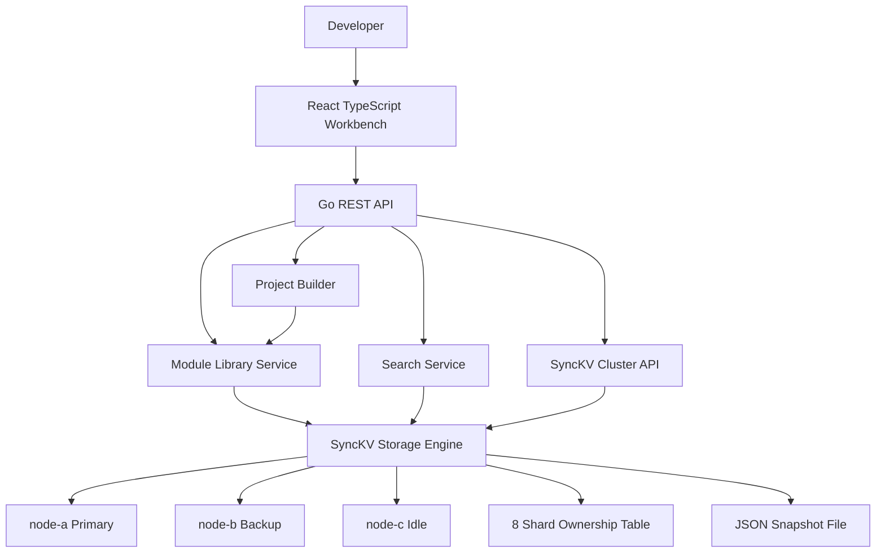
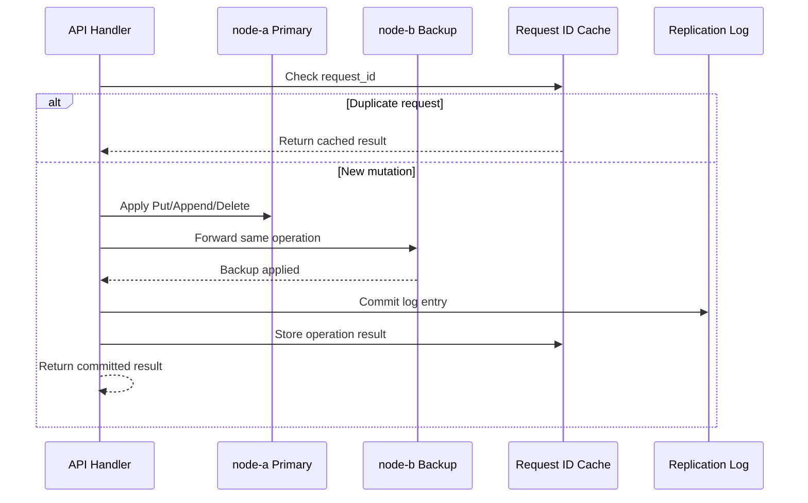
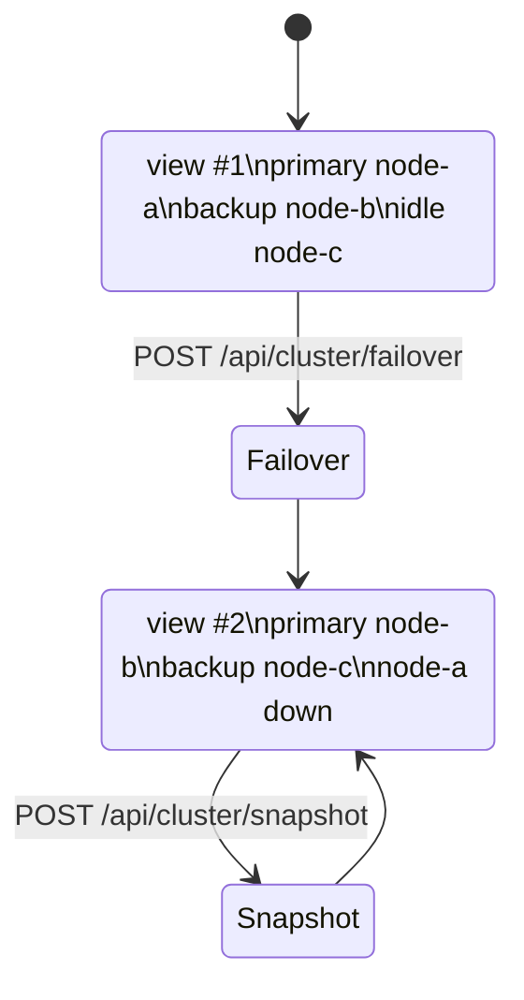
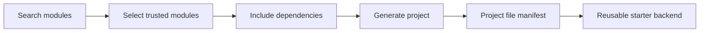

# SnippetSync

SnippetSync is a distributed developer knowledge platform for saving reusable software modules and generating new project starters from code a developer already trusts. Instead of storing one-off snippets, SnippetSync stores complete feature modules with files, dependencies, metadata, tags, and version history.

## Highlights

- Full-stack app with React, TypeScript, Go, Docker, and CI.
- Reusable module library for multi-file software features.
- Search by name, language, framework, description, and tags.
- Project Builder that assembles selected modules into a generated starter project.
- SyncKV observability panel for primary/backup state, replication log, snapshots, and shards.
- Seeded examples for JWT auth, PostgreSQL, Docker, Kafka, logging, Redis, and rate limiting.

## Architecture



## SyncKV Design

SyncKV is intentionally implemented as an in-process distributed-systems simulation. It is not a production consensus system, but it exposes the same core ideas that show up in primary/backup and sharded key/value services.



### Distributed-Systems Concepts Included

- **Numbered views:** SyncKV tracks the active view number, primary, backup, idle nodes, and acknowledgement state.
- **Primary/backup replication:** Mutations are applied to both primary and backup before being treated as committed.
- **Split-brain prevention model:** Writes are rejected if there is no healthy primary and backup pair.
- **Exactly-once writes:** Mutating requests use request IDs so retried appends do not apply twice.
- **Failover:** The backup is promoted when the primary fails, and a healthy idle node becomes the new backup.
- **Shard ownership:** Keys map to one of 8 shards, and shard ownership can be reassigned from the UI/API.
- **Snapshots:** Cluster state can be written to a JSON snapshot file for recovery demos.



## Product Flow



A typical workflow:

1. Search for modules such as JWT Authentication, PostgreSQL, Docker, or Kafka.
2. Select the modules needed for a new backend.
3. Let SnippetSync include required dependencies.
4. Generate a project file tree from the selected modules.
5. Inspect SyncKV to see the storage write, replication log, and cluster state.

## Tech Stack

| Layer | Technology | Purpose |
| --- | --- | --- |
| Frontend | React, TypeScript, Vite, CSS | Module dashboard, project builder, SyncKV observability |
| Backend | Go, `net/http` | REST API and application services |
| Storage | Custom SyncKV package | Replicated key/value simulation |
| DevOps | Docker, Docker Compose | Local full-stack runtime |
| CI | GitHub Actions | Backend tests and frontend build |

## Repository Structure

```text
SnippetSync/
├── backend/
│   ├── cmd/server/              # API entrypoint
│   ├── internal/api/            # REST handlers and API tests
│   ├── internal/models/         # Shared data models
│   ├── internal/seed/           # Seeded reusable modules
│   └── internal/synckv/         # SyncKV cluster implementation and tests
├── frontend/
│   ├── src/api.ts               # API client
│   ├── src/main.tsx             # Main React workbench
│   ├── src/styles.css           # Responsive UI styling
│   └── src/types.ts             # Frontend API types
├── docs/
│   └── architecture.md          # Additional architecture notes
├── docker-compose.yml
└── README.md
```

## API Reference

| Method | Endpoint | Description |
| --- | --- | --- |
| `POST` | `/api/auth/demo-login` | Returns a demo user and token |
| `GET` | `/api/modules` | Lists all saved modules |
| `POST` | `/api/modules` | Creates a new reusable module |
| `GET` | `/api/modules/{id}` | Reads one module |
| `PUT` | `/api/modules/{id}` | Updates one module |
| `DELETE` | `/api/modules/{id}` | Deletes one module |
| `GET` | `/api/search?q=` | Searches modules by text and metadata |
| `POST` | `/api/generate` | Builds a generated project manifest |
| `POST` | `/api/sync` | Resynchronizes backup state from primary |
| `GET` | `/api/cluster/status` | Returns current SyncKV view, nodes, shards, and log |
| `POST` | `/api/cluster/failover` | Promotes backup to primary |
| `POST` | `/api/cluster/snapshot` | Writes a local SyncKV snapshot |
| `POST` | `/api/cluster/reassign-shard` | Moves a shard to another healthy node |

Example generation request:

```bash
curl -X POST http://localhost:8080/api/generate \
  -H "Content-Type: application/json" \
  -d '{
    "project_name": "flask-starter",
    "language": "Python",
    "framework": "Flask",
    "module_ids": ["jwt-auth", "postgresql-setup", "docker-config"]
  }'
```

## Setup Instructions

### Option 1: Docker Compose

This is the easiest way to run the full app.

```bash
docker compose up --build
```

Open:

- Frontend: `http://localhost:5173`
- Backend: `http://localhost:8080`
- Health check: `http://localhost:8080/api/health`

Stop the app:

```bash
docker compose down
```

### Option 2: Run Backend and Frontend Separately

Backend:

```bash
cd backend
go test ./...
go run ./cmd/server
```

Frontend:

```bash
cd frontend
npm install
npm run dev
```

Open `http://localhost:5173`. Vite proxies `/api` requests to `http://localhost:8080`.

## Seeded Modules

| Module | Language | Framework | Dependencies |
| --- | --- | --- | --- |
| JWT Authentication | Python | Flask | Logging Framework |
| PostgreSQL Setup | Python | Flask | Docker Configuration |
| Docker Configuration | Docker | Compose | None |
| Kafka Producer | Python | FastAPI | Logging Framework |
| Kafka Consumer | Python | FastAPI | Kafka Producer, Logging Framework |
| Logging Framework | Python | Any | None |
| Redis Cache | Python | Flask | Docker Configuration |
| Rate Limiter | Python | Flask | Redis Cache |

## Testing and Verification

Backend tests cover:

- Module search.
- Project generation with dependency expansion.
- Duplicate request IDs for exactly-once append behavior.
- Failover data preservation.
- Shard ownership reassignment.
- Shard ownership transfer away from a failed primary during failover.

Run backend tests:

```bash
cd backend
go test ./...
```

Run frontend build:

```bash
cd frontend
npm install
npm run build
```

Run full Docker verification:

```bash
docker compose build
docker compose up -d
```

## Results

Implementation results from the local build:

| Check | Result |
| --- | --- |
| Frontend production build | Passed with `npm run build` |
| Docker backend image build | Passed |
| Docker frontend image build | Passed |
| Backend tests in Docker | Passed: `internal/api` and `internal/synckv` |
| Backend container smoke test | Passed: returned `{"status":"ok"}` |
| Frontend container smoke test | Passed: served built HTML |

Observed Docker note: Docker reported the ports as published at `0.0.0.0:8080` and `0.0.0.0:5173`, and both services responded inside their containers. If `localhost` does not open from the host browser, restart Docker Desktop and run `docker compose up -d` again.

## What This Project Demonstrates

- Built a real full-stack app with typed frontend code and Go backend services.
- Designed an API for reusable multi-file software modules.
- Implemented a project generator that composes modules and dependencies.
- Built a custom key/value storage layer with primary/backup replication semantics.
- Added failover, exactly-once request handling, snapshots, shard ownership, and observability.
- Documented the design with architecture diagrams and reproducible setup steps.

## Future Work

- Replace the in-process SyncKV simulation with real multi-process RPC nodes.
- Add a replicated view service or consensus-backed coordinator.
- Implement Paxos or Raft for stronger consensus semantics.
- Add real ZIP download support for generated projects.
- Add persistent user accounts and module ownership.
- Add visual test coverage for the frontend workflow.
