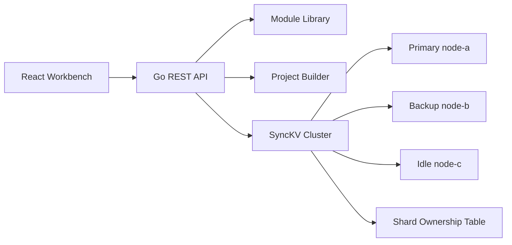

# SnippetSync Architecture

SnippetSync is a developer knowledge platform backed by SyncKV, a small in-process distributed key/value simulation. The product layer stores reusable software modules, while SyncKV makes the storage behavior inspectable for portfolio and learning purposes.

## SyncKV Concepts

- Numbered views track the current primary, backup, and idle nodes.
- Writes commit only after the primary and backup both apply the operation.
- Request IDs cache mutation results, so retried appends do not apply twice.
- Failover marks the old primary down, promotes the backup, and recruits an idle node as the new backup.
- Snapshots write cluster state to `backend/data/synckv-snapshot.json`.
- Shards map keys to owners and can be reassigned through the API/UI.

## Course-Project Influence

The design intentionally borrows concepts from primary/backup KV services and sharded KV systems: view changes, split-brain prevention, exactly-once writes, shard ownership, and reconfiguration. It does not implement full Paxos or real multi-process RPC replication in v1; those are documented extensions.
